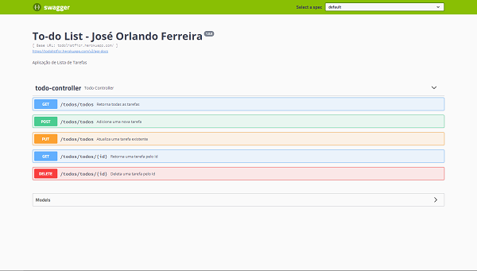

<h1 align="center">
    
</h1>
<h3 align="center">
   <a href="http://todolistficr.herokuapp.com/swagger-ui.html#/todo-controller">Deploy</a>
</h3>
<h4  align="center">

Status: ✅Concluido.✅

</h4>

  

# Indice

  

-  [Sobre](#-sobre)

-  [Tecnologias Utilizadas](#-Tecnologias-utilizadas)

-  [Como baixar o projeto](#-Como-baixar-o-projeto)

  

## 📋 Sobre

  

Projeto backend de API REST com SpringBoot, desenvolvido durante o segundo semestre do curso de ADS/SI na **[FICR](https://ficr.catolica.edu.br/portal/)**, com o intuito de colocar em prática todo conteúdo estudado durante o período.

  

---

  
  

## 🚀 Tecnologias utilizadas

  

O projeto foi desenvolvido utilizando as seguintes tecnologias

  

-  [Java](https://www.java.com/pt-BR/)

-  [SpringBoot](https://spring.io/)

-  [Swagger](https://swagger.io/tools/swagger-ui/)


---

  

## 📁 Como baixar o projeto

  

```bash
# Clonar o repositório

$ git clone https://github.com/orlandofnfilho/todoListApp

```